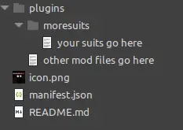

<h3>This page up to date for:</h3>


# Overview

  


You will learn:
- The names and functions of each file required to create a Thunderstore package
- The quirks of the various mod managers and the directory flattening rules your package must follow
  - How to apply the above skills to create a package with a specific directory structure (EG: A `moresuits` mod)
- How to update an existing package

Prerequisites:
- A [Thunderstore Account](https://thunderstore.io) (for publishing)
  - A Thunderstore [Team](https://thunderstore.io/settings/teams/) to publish to.

# Uploading Your First Package

Hey, you made a mod, great work! But uploading to the Thunderstore can be a bit daunting and there are a few _gotchas_ that aren't really well documented. In this brief tutorial I will help you avoid common pitfalls and successfully upload your first (or perhaps beyond) package to our community.

## Table of Contents
- [Overview](#overview)
- [Uploading Your First Package](#uploading-your-first-package)
  - [Table of Contents](#table-of-contents)
- [Package basics](#package-basics)
  - [Required Files](#required-files)
    - [icon.png](#iconpng)
    - [README.MD](#readmemd)
    - [manifest.json](#manifestjson)
      - [Name](#name)
      - [Version](#version)
      - [Website URL](#website-url)
      - [Description](#description)
      - [Dependencies](#dependencies)
  - [Optional Files](#optional-files)
    - [CHANGELOG.MD](#changelogmd)
    - [License](#license)
- [Package Structure](#package-structure)
  - [Why do mod managers unpack my mod differently?](#why-do-mod-managers-unpack-my-mod-differently)
  - [Examples](#examples)
    - [Packaging for Moresuits](#packaging-for-moresuits)
    - [Packaging a Modpack](#packaging-a-modpack)
- [Updating My Existing Mod](#updating-my-existing-mod)

# Package basics

There are a few basic files every package should have, lets go over them one at a time. You can follow along in this section, or use the [site documentation](https://thunderstore.io/package/create/docs/) instead if you think you can manage on your own.

{: .important}
> All file names should match the ones I've provided exactly, this includes capitalization.

If you'd like to you may follow along with a pre-made zip file: [Download](https://github.com/LethalCompanyModding/Thunderstore/raw/main/www/Guides/attachments/howto/example-mod.zip)

## Required Files

### icon.png

This should be a unique icon of dimensions 256x256 for your mod. Seriously, use _exactly_ 256x256 or it will not work. It will show up in the Thunderstore and mod managers so make it interesting, descriptive and appropriate to a PG-13/PEGI-12 audience. 

{: .warning}
> It is Thunderstore policy that even mods marked as NSFW may not have NSFW material in the icon.

### README.MD

This file is a standard markdown file that describes your mod. Please be descriptive and tell users what to expect when installing and using your mod. Include important information such as what parts of the mod are configurable and known issues to be extra helpful.

You may use [the markdown preview tool](https://thunderstore.io/tools/markdown-preview/) to make sure your readme looks good

{: .warning}
> It is Thunderstore policy that even mods marked as NSFW may not have links to NSFW sites in their README file

### manifest.json

The Manifest file contains all the information needed to install your mod automatically for users.

Example:

```json
{
    "name": "LCModTest",
    "version_number": "1.0.0",
    "website_url": "https://github.com/LethalCompanyModding/thunderstore",
    "description": "This is my mod description. I understand that uploading this example manifest may result in my mod being removed.",
    "dependencies": [
        "LethalCompanyModding-FakeMod-1.0.0"
    ]
}
```

#### Name

The `name` field and your team name used when uploading the mod will become the mod's final package ID and __cannot be changed__ without uploading a new package completely, so choose wisely.

#### Version

The `version_number` field is a semantic version following the format x.y.z and can be incremented (made larger) to update an existing package rather than upload a new one. See also: [SemVer Docs](https://semver.org/)

#### Website URL

The `website_url` field can be any link. It will be placed in a highly visible location on the Thunderstore page for your mod and should not contain any NSFW content when clicked. You may use it for nearly any purpose, but I suggest linking a github repo or social media. You may leave this field blank if you have nothing you wish to link.

#### Description

The `description` field is a short text description of your package. It cannot exceed 250 characters. This description will show up in search results on the Thunderstore

#### Dependencies

The `dependencies` field is an array of other existing mods on the Thunderstore your mod requires to run. Mod managers will automatically download these files so you do not need to include them in your package and doing so may result in your package being marked invalid and rejected.

Example use:

In order to include [Enhancer](https://thunderstore.io/c/lethal-company/p/Mom_Llama/Lethal_Company_Enhancer/) as a dependency to your mod (Don't do this, nothing depends on Enhancer, this is an example only), first go to its Thunderstore page and look at this line: `Dependency string: Mom_Llama-Lethal_Company_Enhancer-0.1.12` that is Enhancer's dependency string, IE what you put in the dependency field. So our mod's dependencies field would look like this:

```json
"dependencies": [
        "Mom_Llama-Lethal_Company_Enhancer-0.1.12"
    ]
```

If we wanted to include multiple dependencies we should add commas to the end of each dependency line that is followed by another line, like so:

```json
"dependencies": [
        "LethalCompanyModding-FakeMod-1.0.0",
        "Mom_Llama-Lethal_Company_Enhancer-0.1.12"
    ]
```

## Optional Files

{: .note}
> Not every file needs to be included to make your package work, but having these will make your mod stand out just a bit more and look more professional.

### CHANGELOG.MD

This is simply another markdown file, just like the README. The difference is this file will be shown in its own tab for users to keep up on what you've recently changed in your mod. See [Enhancer](https://thunderstore.io/c/lethal-company/p/Mom_Llama/Lethal_Company_Enhancer/changelog/) for an example of how this will look in the browser.

### License

{: .tip}
> This file has no required name nor is it required to upload your package successfully, but it is highly recommend you do so anyway. A License file should be immediately recognizable as such and the filenames LICENSE, LICENSE.MD or LICENSE.TXT are very common and popular choices.

You may be asking "Why do I need a license?" well, a license tells users, other modders and Thunderstore staff what other people are allowed to do with your mod. A license may include provisions or prohibitions for nearly anything including selling your mod as part of a compilation, copying and redistributing your mod or forking / creating derived works.

For help choosing an appropriate license for your work see [Choosing a License](Choosing-A-License.html)


{: .important}
> For Library Developers:
>
>New mods intended for use and consumption as libraries must have permissive licensing to remain listed in the Lethal Company section of Thunderstore. Please familiarize yourself with different licenses and choose the appropriate one promptly to ensure your mod stays listed. Existing Mod authors should select an appropriate license and either bundle it in their package as a LICENSE file as recommended in the Packaging Tutorial or link to a public github repository that contains such a LICENSE file as their web link.

{: .warning}
> A Deadline Approaches:
> 
> This Guideline will be enforced more strictly beginning September 1st 2024, please take this time to bring your existing packages into compliance

# Package Structure

## Why do mod managers unpack my mod differently?

R2ModManager / ThunderstoreMM both unpack mods into their own directory named after its dependency string and flatten the file hierarchy. This is a security feature and cannot be disabled _but_ there is a list of certain override directories that will change this behavior. See the documentation on the [R2ModMan Github repo](https://github.com/ebkr/r2modmanPlus/wiki/Structuring-your-Thunderstore-package) for more information on how to package your files so that they extract how your mod expects them to.

## Examples

### Packaging for Moresuits

As an example of how to control the unpacking of your mod, lets examine the library [MoreSuits by 753](https://thunderstore.io/c/lethal-company/p/x753/More_Suits/). Moresuits is a library that loads textures from the /moresuits/ folder in every other plugin folder as suits for you and your friends to wear. In order to make this directory unpack correctly you simply need to follow the instructions in the r2modman repo and create a `moresuits` folder underneath another one named `plugins`. R2MM will recognize this folder structure and override the default behavior to preserve it.

Your folder should look something like this



### Packaging a Modpack

First, you should consider if you _need_ to upload a modpack. R2ModMan can export profile codes to quickly share your mod list and config files with your friends. If that's all you need, then great, you can simply use a profile code instead. Modpacks are great for sharing with more than a few people, can include a readme and can be updated, so they can be an attractive option for creators. Let's go thru an example modpack now.

1. Create your icon, manifest readme and changelog the same as any other package. See [above](#package-basics) for more information on these files and their purpose.

2. If you have modified the configuration settings for any of the mods your modpack will include, copy their configuration file from your profiles BepInEx/config/ folder into a folder called `config`

{: .important}
> Do not include any actual DLLs in your modpack. All mods your pack requires should be listed as dependencies. Do not include the contents of your BepInEx/core folder, these are system files that are already installed for every user. Do not include copyrighted content or content you do not have the full legal rights to distribute.

Your final folder structure should look like this:


# Updating My Existing Mod

To update an existing mod, simply change the manifest.json `version` field to be higher than it was previously and then upload your changes again to the same Team you did the first time.
